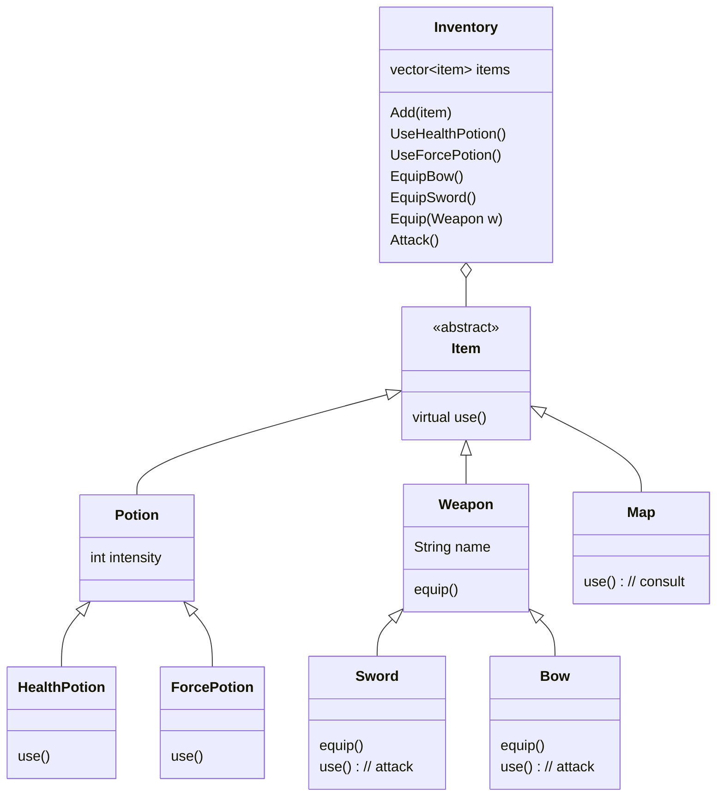

# Formative — OOP — Inventory

> Source : [Google Drawing](https://docs.google.com/drawings/d/1X45oBgULpG9qzEvc8ll08ZfwipjnNe3kia-BOQkQYb8/edit)
> Cours associé : [[04 - OOP Advanced]] · [[Exercices - 04 - OOP]]

![[formative_oop_inventory.png]]

## Hiérarchie proposée

La classe de base `Item` expose une méthode `virtual use();` que chaque objet spécialise. L'`Inventory` stocke des `Item` et déclenche leur utilisation.

Le schéma laisse une question ouverte pour l'`Inventory` : soit une méthode par action concrète (`UseHealthPotion()`, `EquipBow()`, `EquipSword()`…), soit une méthode générique paramétrée (`Equip(Weapon w)`). C'est le point de discussion de l'exercice.
