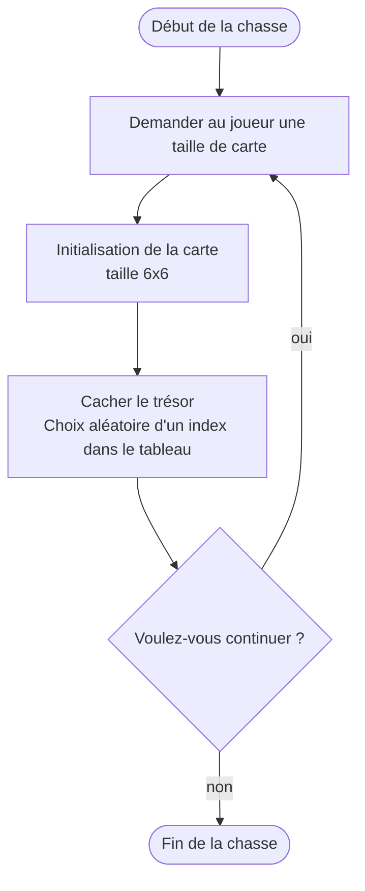

# Algo — Treasure Hunt

> Source : [Google Drawing](https://docs.google.com/drawings/d/1hfEww8cZW_o6jgRDN31vgWN90Qm3_1RFU8nXuPFGSpE/edit)
> Cours associé : [[03 - Data Structures (array, vector, map, etc.)]]

![[algo_treasure_hunt.png]]

## Organigramme

Exemple d'organigramme (schéma de séquence) attendu avant d'implémenter : on décrit le déroulement du programme avant d'écrire la moindre ligne de code.

