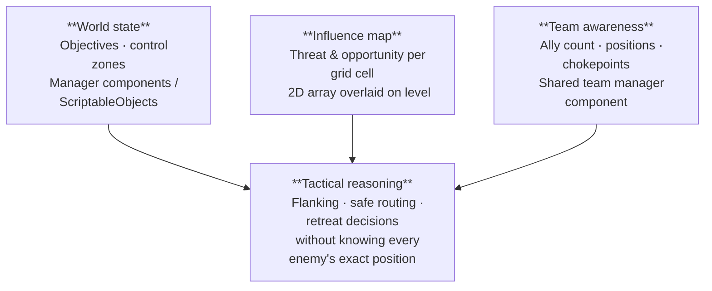

# Chapter 1 - Perceptions

# a — Physics world

The raw spatial layer. The NPC queries the engine's physics system directly — no game logic, no meaning yet, just geometry.

| Use | Answers | Tool | Unity API |
| --- | --- | --- | --- |
| Line of sight / Obstacles | Is this point visible from here? | **Raycast** | `Physics.Raycast` |
| Distance / AOE / Drtection area | What is within range of me? | **Overlap / sphere cast** | `Physics.OverlapSphere` |
| **Field of view** | What is in my field of view? | **FOV cone** | Sphere cast + `Vector3.Angle` |
| Navigation | Can I walk there, and how far? | **NavMesh query** | `NavMesh.SamplePosition`, `NavMeshPath` |

> ⚠️ Physics queries return **geometry**, not meaning. Interpretation is the next level's job.
> 

---

# b — Entities

Once the physics layer says "something is there and visible", the entity layer asks: *what is it, and what state is it in?*

### 💡 Think ! 💡

> What we need to know ? 
How can we get ?
> 
- Identity & state
    
    [https://link.excalidraw.com/readonly/1KtE8cxw4xEAFdURcXKT?darkMode=true](https://link.excalidraw.com/readonly/1KtE8cxw4xEAFdURcXKT?darkMode=true)
    

> 🔒 The NPC **reads only** — it never writes to another entity's state.
> 

## Detection vs Memory

|  | 🟢 Detection | 🟡 Memory | 🔘 Forgotten |
| --- | --- | --- | --- |
| **Condition** | Entity currently in FOV | Entity left FOV | Timestamp expired |
| **Data** | Live position & state | Last known position + timestamp | — |
| **NPC behavior** | Track and react in real time | Move to last known pos, investigate | Return to patrol |

[https://link.excalidraw.com/readonly/4pBtnGceeTIo9yZaoYqf?darkMode=true](https://link.excalidraw.com/readonly/4pBtnGceeTIo9yZaoYqf?darkMode=true)

> **Why it matters :**
> 
> - without this split, the NPC either always knows where you are (cheat) or instantly forgets you (stupid).
> - Memory is the middle ground —
>     - the NPC investigates *where it last saw you*, not where you actually are.
>     - The timestamp drives decay → three behaviors from one field: *react → investigate → give up*.

---

# c — Strategic level

The highest level — not about individual entities, but about the **state of the battlefield as a whole**.

| Source | What it provides | Implementation |
| --- | --- | --- |
| **World state** | Objectives taken, zones controlled | Manager components / ScriptableObjects |
| **Influence map** | Threat / opportunity score per grid cell | 2D array overlaid on level |
| **Team awareness** | Ally count, positions, chokepoints | Shared team manager component |

> 📈 **Progression to share with students:**
> 

> - *"Is something there?"* → Physics
> 

> - *"What is it doing?"* → Entities
> 

> - *"What is the state of the battlefield?"* → Strategic
> 

> Each level requires a wider view and produces richer decisions.
> 

---

# Key references

- [Game AI Pro vol. 1 — "Crytek's Target Tracks Perception System" (Rich Welsh) — free PDF](http://www.gameaipro.com/GameAIPro/GameAIPro_Chapter31_Crytek's_Target_Tracks_Perception_System.pdf) · All Game AI Pro chapters free at [gameaipro.com](http://gameaipro.com)
- [Game AI Pro vol. 2 — "Modeling Perception and Awareness in Splinter Cell: Blacklist" (Martin Walsh) — free PDF](http://www.gameaipro.com/GameAIPro2/GameAIPro2_Chapter28_Modeling_Perception_and_Awareness_in_Tom_Clancy's_Splinter_Cell_Blacklist.pdf)
- [GDC 2011 — "Lay of the Land: Smarter AI Through Influence Maps" (Damian Isla, ex-Bungie) — GDC Vault](https://gdcvault.com/play/1014498/Lay-of-the-Land-Smarter)
- [GDC 2014 — "The Last of Us: Human Enemy AI" (Travis McIntosh, Naughty Dog) — GDC Vault](https://gdcvault.com/play/1020338/The-Last-of-Us-Human)
