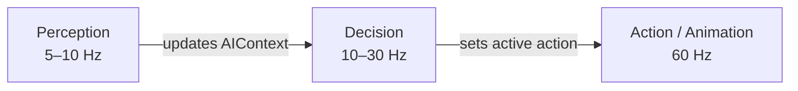

# Chapter 3 — Software architecture

# Why architecture matters

A great sensor layer and a great action system will still produce broken AI if they are tangled together. The goal of this chapter is one principle: **the decision layer should never reach directly into the game world**.

> 💡 If your AI scoring logic calls a physics query directly, the architecture is broken. Sensing, deciding, and acting must be three separate, decoupled concerns.
> 

---

# The three-layer model

The entire AI pipeline maps onto three layers, each with a single responsibility.

The **AIContext** object is the contract between them — a plain data bag filled by sensors and consumed by decisions. Neither layer needs to know how the other works.

[https://link.excalidraw.com/readonly/XbXkhnU65kxeyvvZWY0J?darkMode=true](https://link.excalidraw.com/readonly/XbXkhnU65kxeyvvZWY0J?darkMode=true)

---

# The AIContext — the architectural contract

The `AIContext` is what enforces the decoupling. The decision layer reads it; it never reaches past it.

What it holds:

| Category | Examples |
| --- | --- |
| **Perception data** | Visible enemies list, most threatening target, last known positions |
| **Self state** | Health ratio, ammo count, current cover status |
| **Spatial data** | Distance to target, nearest cover point, is exposed |
| **Aggregate scores** | Threat level [0–1], computed from sensor output |

```csharp
public class AIContext
{
    // --- Filled by Sensor layer ---
    public List<Percept>  visibleEnemies      = new();
    public Percept?       primaryTarget;
    public Vector3?       nearestCoverPoint;
    public bool           isExposed;
    public float          threatLevel;         // [0–1] aggregate

    // --- Self state (filled by Sensor layer reading own components) ---
    public float          health;
    public float          maxHealth;
    public int            ammoCount;

    // --- Set by Decision layer ---
    public IAIAction      currentAction;

    // --- Helpers ---
    public float HealthRatio  => health / maxHealth;
    public bool  HasTarget    => primaryTarget.HasValue;
}
```

> The decision layer is now fully unit-testable: feed it a fake AIContext and verify which action wins — no game engine required.
> 

---

# Key architectural requirements

## Tick rate separation

Not every system needs to run every frame. Perception can run at 5–10 Hz — fast enough to feel responsive, slow enough to save CPU. Animation runs at 60 Hz. Decoupling tick rates is only possible because the layers don't share state directly.



## Action interruption

The decision layer runs each tick. If a new action outscores the current one, it must preempt cleanly. Every action must therefore implement an `Interrupt()` contract that leaves the world in a consistent state — nav path reset, animation cancelled, state flags restored.

## No cross-layer access

The three hard rules:

- The **sensor layer** never calls decision or action logic
- The **decision layer** never queries physics or reads entity components directly
- The **action layer** never scores or selects — it only executes what the decision layer chose

---

# Why this matters in practice

| Without decoupling | With decoupling |
| --- | --- |
| AI logic scattered across physics callbacks | Each layer has one place to look |
| Impossible to test decisions without running the game | Decision layer testable with fake context |
| Changing sensing breaks scoring functions | Layers change independently |
| Performance hard to profile | Tick rates tunable per layer |

---

# Key references

- [*Programming Game AI by Example* — Mat Buckland](https://www.amazon.com/Programming-Game-Example-Mat-Buckland/dp/1556220782) — architecture chapters, decoupled state machines
- [GDC 2014 — *The Last of Us: Human Enemy AI* (Naughty Dog) — GDC Vault](https://gdcvault.com/play/1020338/The-Last-of-Us-Human) — full perception pipeline and decoupled architecture in production
- [Game AI Pro vol. 2 — "Architecture Tricks: Managing Behaviors in Time, Space, and Depth" — free PDF](http://www.gameaipro.com/GameAIPro2/GameAIPro2_Chapter03_Architecture_Tricks_Managing_Behaviors_in_Time_Space_and_Depth.pdf)
