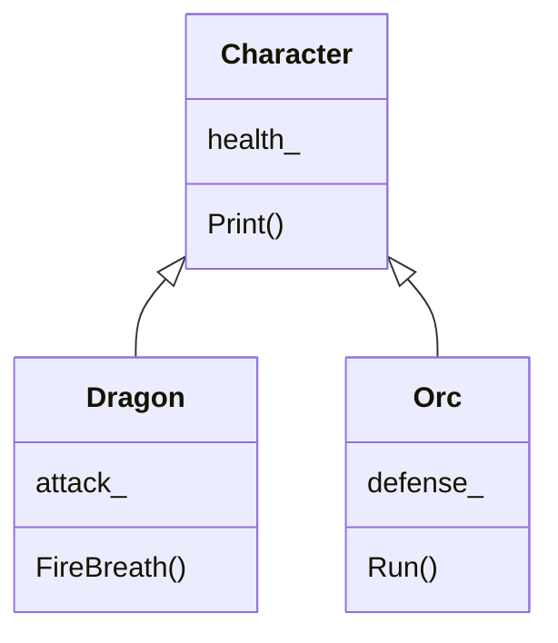
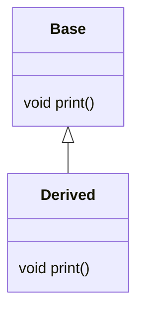

# Object-Oriented Programming
<!-- .slide: data-background="00 images/01_slide_fond_titre.jpg" -->

### Advanced — static, surcharge, héritage, polymorphisme

<small>Module 4FSC0PF001 · Introduction to Games Programming</small>

Note:
Suite de [[01.03 - Basics OOP]]. Quatre sujets : ce qui appartient à la
classe plutôt qu'à l'instance (`static`), donner un sens aux opérateurs,
réutiliser du code par héritage, et enfin choisir le comportement à
l'exécution avec les fonctions virtuelles.

---

## Source
<!-- .slide: data-background="00 images/01_slide_fond_titre.jpg" -->

<div style="color:#fff;">

Présentation d'origine (contient les schémas non transposés) :

- 🔗 [Google Slides — 04 OOP Advanced](https://docs.google.com/presentation/d/1ybWagXO7WpCXxiYdodSQqti90s-RkA6_kW-3hcnMjuo/edit)

Exercices : [[Exercices - 04 - OOP]] · Formatives : [[Formative - OOP Minigame (Monster Fight Simulator)]] · [[Formative - OOP - Creer un verger]] · [[Formative - OOP - Inventory]]

</div>

---

# Static
<!-- .slide: data-background="00 images/01_slide_fond_content.jpg" -->

---

## Class — static attribute
<!-- .slide: data-background="00 images/01_slide_fond_titre.jpg" -->

**`monster.h`**

```cpp
    void printInfo();

    // Static method
    static void monsterCountPrint();

private:
    int health;
    int attack;

    // Static member
    static int monsterCount;
```

**`monster.cpp`**

```cpp
int Monster::monsterCount = 0;

void Monster::monsterCountPrint()
{
    std::cout << "There is " << monsterCount
              << " monsters living." << std::endl;
}
```

**`main.cpp`**

```cpp
int main()
{
    Monster monsterA;
    Monster::monsterCountPrint();

    Monster monsterB(100, 100);
    Monster::monsterCountPrint();

    monsterA.printInfo();
    monsterB.printInfo();
}
```

Note:
Le membre statique doit être **défini** dans le `.cpp`, en plus d'être
déclaré dans le `.h` — c'est la ligne `int Monster::monsterCount = 0;`.
C'est l'oubli classique, et l'erreur de linkage qui va avec.

---

## Membres et méthodes static
<!-- .slide: data-background="00 images/01_slide_fond_titre.jpg" -->

**Membres static**

- la valeur est « partagée » entre toutes les instances
- peut être accédé depuis l'intérieur de la classe
- peut être accédé depuis une instance de la classe (selon visibilité)

**Méthodes static**

- ne peuvent accéder **qu'aux membres statiques**

---

## struct
<!-- .slide: data-background="00 images/01_slide_fond_titre.jpg" -->

```cpp
struct Monster {
    int health;
    int attack;
    int defense;
};
```

---

## Class vs struct
<!-- .slide: data-background="00 images/01_slide_fond_titre.jpg" -->

| | Visibilité par défaut |
|---|---|
| **Class** | privée |
| **Struct** | publique |

De manière générale, utiliser un `struct` **sans fonction**, juste pour maintenir des données.

---

# Surcharge d'opérateur
<!-- .slide: data-background="00 images/01_slide_fond_content.jpg" -->

---

## Surcharge d'opérateur
<!-- .slide: data-background="00 images/01_slide_fond_titre.jpg" -->

Il est possible de surcharger les opérateurs pour faire des opérations entre instances :

- assignment operator : `operator=`
- stream extraction and insertion : `operator>>`, `operator<<`
- function call operator : `operator()`
- increment and decrement : `operator++`, `operator--`
- arithmetic operators
- comparison operators : `operator==`, `operator!=`, `operator<`, `operator>`, `operator<=`, `operator>=`
- `operator[]`

<small>[en.cppreference.com/w/cpp/language/operators](https://en.cppreference.com/w/cpp/language/operators)</small>

---

## Surcharge d'opérateur — exemple
<!-- .slide: data-background="00 images/01_slide_fond_titre.jpg" -->

**`myOwnTime.h`**

```cpp
#include <iostream>

class myOwnTime
{
public:
    myOwnTime(int hours_ = 0, int minutes_ = 0, int seconds_ = 0);
    ~myOwnTime();

    myOwnTime operator+(myOwnTime& t1);

    int seconds;
    int hours;
    int minutes;

    void print();
};
```

**`myOwnTime.cpp`**

```cpp
#include "myOwnTime.h"

myOwnTime myOwnTime::operator+(myOwnTime& t1)
{
    int hours   = this->hours   + t1.hours;
    int minutes = this->minutes + t1.minutes;
    int seconds = this->seconds + t1.seconds;

    return myOwnTime(hours, minutes, seconds);
}

void myOwnTime::print()
{
    std::cout << hours << ":" << minutes << ":" << seconds << std::endl;
}
```

**`main.cpp`**

```cpp
#include <iostream>
#include "myOwnTime.h"

int main()
{
    myOwnTime timeA(04, 03, 15);
    myOwnTime timeB(15, 35, 20);

    timeA.print();
    timeB.print();

    myOwnTime timeC = timeA + timeB;
    timeC.print();
}
```

---

## Pause
<!-- .slide: data-background="00 images/01_slide_fond_titre.jpg" -->

Question time !

Vous pouvez aussi jouer avec VS2019 — ou faire une pause, au cas où votre cerveau serait en train de fondre…

---

# Héritage
<!-- .slide: data-background="00 images/01_slide_fond_content.jpg" -->

---

## Héritage — le principe
<!-- .slide: data-background="00 images/01_slide_fond_titre.jpg" -->



---

## Héritage — le code
<!-- .slide: data-background="00 images/01_slide_fond_titre.jpg" -->

**`monster.h`**

```cpp
#include <iostream>

class Monster
{
public:
    Monster(int attack_, int health_);   // Constructor
    void Print();                        // Print informations

private:
    int health;     // How many life points

protected:
    int atttack;    // How hard the monster can strike
};

Monster::Monster(int attack_, int health_)
    : atttack(attack_), health(health_)
{
}

void Monster::Print()
{
    std::cout << "Monster properties [health:" << health
              << ", attack:" << atttack << "]" << std::endl;
}
```

**`dragon.h`**

```cpp
#include "monster.h"

class Dragon : public Monster
{
    using Monster::Monster;

public:
    void Fire();
    void PrintHealth();
};

void Dragon::Fire()
{
    std::cout << "FIRE Attack : " << this->atttack << std::endl;
}

void Dragon::PrintHealth()
{
    std::cout << "Life points : " << this->health << std::endl;
}
```

---

## Héritage — les deux points à retenir
<!-- .slide: data-background="00 images/01_slide_fond_titre.jpg" -->

- **héritage du constructeur** avec la directive `using`
- le mot-clé **`protected`** permet aux classes filles d'utiliser les membres et méthodes de la classe parent

Note:
Ces deux points expliquent le code de la diapo précédente : `Fire()`
accède à `atttack` parce qu'il est `protected`, alors que
`PrintHealth()` ne compilerait pas — `health` est `private`. C'est
justement l'erreur à faire remarquer aux étudiants.

---

## Héritage — le « mode »
<!-- .slide: data-background="00 images/01_slide_fond_titre.jpg" -->

```cpp
class A {
public:    int x;
protected: int y;
private:   int z;
};

class B : public A {
    // x est public
    // y est protected
    // z n'est pas accessible
};

class C : protected A {
    // x est protected
    // y est protected
    // z n'est pas accessible
};

class D : private A {
    // x est private
    // y est private
    // z n'est pas accessible
};
```

**Le mode d'héritage « réduit » la visibilité.**

---

## Héritage multiple
<!-- .slide: data-background="00 images/01_slide_fond_titre.jpg" -->

```cpp
class B {
public:    int xx;
};

class A {
public:    int x;
protected: int y;
private:   int z;
};

class C : public A, public B {
};
```

---

# Polymorphisme
<!-- .slide: data-background="00 images/01_slide_fond_content.jpg" -->

---

## Polymorphisme
<!-- .slide: data-background="00 images/01_slide_fond_titre.jpg" -->

- Le C++ utilise un **typage statique** : le type d'un objet est déterminé lors de la **compilation**.
- Dans certains cas, on a besoin que le typage soit **dynamique** : le type d'un objet est déterminé lors de l'**exécution**.

⇒ C'est le **polymorphisme**. Il est mis en œuvre en faisant appel aux **fonctions virtuelles**.

---

## Héritage virtual
<!-- .slide: data-background="00 images/01_slide_fond_titre.jpg" -->



Les deux classes déclarent `print()` : laquelle sera appelée ?

---

## Héritage virtual — la démonstration
<!-- .slide: data-background="00 images/01_slide_fond_titre.jpg" -->

```cpp
class A {
public:
    virtual void Print() { std::cout << "base\n"; }
            void Show()  { std::cout << "base\n"; }
};

class B : public A {
public:
    void Print() { std::cout << "derived\n"; }
    void Show()  { std::cout << "derived\n"; }
};

int main() {
    A *a;
    B b;
    a = &b;

    a->Print();   // derived
    a->Show();    // base
}
```

Note:
Tout le cours de polymorphisme tient dans ces deux lignes de sortie. Même
pointeur, même objet — seul `virtual` change le résultat. Sans `virtual`,
c'est le type du **pointeur** qui décide ; avec, c'est le type de
l'**objet**.

---

## Héritage virtual pur
<!-- .slide: data-background="00 images/01_slide_fond_titre.jpg" -->

```cpp
// a virtual pure method can be seen as an interface.
class A {
public:
    virtual void Print() = 0;
    virtual void Show()  = 0;
};

class B : public A {
public:
    void Print() override { std::cout << "derived\n"; }
    void Show()  override { std::cout << "derived\n"; }
};

// You won't be able to create an A,
// as it has virtual pure methods.

int main() {
    A *a;      // this is a pointer, so ok!
    B b;
    a = &b;

    a->Print();  // derived
    a->Show();   // derived
}
```

---

## Pause
<!-- .slide: data-background="00 images/01_slide_fond_titre.jpg" -->

Question time !

Vous pouvez aussi jouer avec VS2019 — ou faire une pause, au cas où votre cerveau serait en train de fondre…
