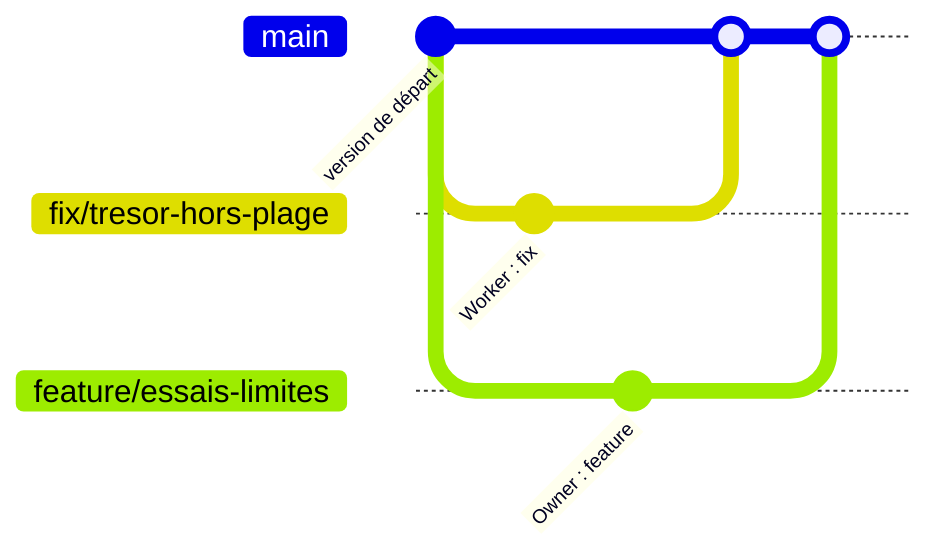

# Branches et intégration

> [!abstract] Séance d'1 h — `GPR-CF-GTE-02` · bloc GSDA *Git et Travail en Équipe*
> GP-926 + WEB-926 · salle Arve · **2026-09-30** · 09:30–10:50 (Module 1 — 7 sept. → 13 nov. 2026)

## À couvrir

Créer et changer de branche, merge, rebase, ce que chacun réécrit, conflit et résolution, pull request et revue, écosystème GitHub, GitLab et forge locale

## Ce qu'il y a à faire

**Découper un deck existant.** `00 Tips - How to (Git, etc.)` (3,9 ko) porte 3 heures de ce lot : en extraire la tranche d'1 h correspondant au contenu ci-dessus. Les autres tranches vont à `GPR-CF-GTE-01`, `GPR-CF-GTE-03` — les découper en une seule passe évite de rouvrir le deck 3 fois.

## Plan et exercices — overview à valider

> [!todo] Produit les 27 et 28 septembre 2026, en attente de validation
> - **Plan du deck** : [[01 courses/slides/C++/GPR-CF-GTE-02 - Branches et intégration|GPR-CF-GTE-02 - Branches et intégration]] — 15 slides, `publish: false` · widgets proposés : `git_graph_widget.html`, `git_conflict_widget.html` ; 1 schéma à dessiner.
> - **Overview des exercices** : [[01 courses/exercises/C++/GPR-CF-GTE-02 - Branches et intégration|GPR-CF-GTE-02 - Branches et intégration]] — 4 courts, 1 complet, 1 difficile.
>
> Rien n'est rédigé : chaque slide ne porte qu'un titre et une phrase directrice, chaque
> exercice qu'une piste de deux ou trois lignes. C'est la base des développements à venir.

## Matériel

- Support : [[00 Tips - How to (Git, etc.)]] — `01 courses/lectures/C++/00 Tips - How to (Git, etc.).md` (3,9 ko)
    - Slides d'origine : https://docs.google.com/presentation/d/1ynVuF4Stssp_Qah9BGvz-qCh7j1czABkqER7qZmVcLE/edit
- Fiche du bloc : `_GSDA_Tech_Vault/Bloc/Git et Travail en Équipe.md`, ligne `02`
- Atelier : [[01 courses/exercises/C++/GPR-CF-GTE-02 - Branches et intégration|énoncé complet]] — binôme, fork + droits, fix et feature, merge propre puis conflit
- Companion : `01 courses/companion projects/C++/GPR-CF-GTE-02 - Chasse au trésor` → `StudioAlbert/GPR_CF_GTE_02_ChasseAuTresor`
- Widgets : `00 widgets/_widgets/git_graph_widget.html` (`#libre` `#compare`), `git_conflict_widget.html` (quiz, 7 onglets)
- Aide-mémoire : [GitHub Git Cheat Sheet](https://education.github.com/git-cheat-sheet-education.pdf)

## Liens

- Séance précédente : [[01 courses/lectures/C++/GPR-CF-GTE-01 - Principes et premier dépôt]]
- Séance suivante : [[GPR-CF-GTE-03 - Travail à plusieurs et fichiers lourds]]

## Notes de préparation

### Publier le companion (avant mercredi)

Le dépôt doit être **public** pour que les élèves puissent le forker. Depuis
`01 courses/companion projects/C++/GPR-CF-GTE-02 - Chasse au trésor` :

```bash
git init -b main
git add .
git commit -m "Chasse au trésor : première version"
git remote add origin https://github.com/StudioAlbert/GPR_CF_GTE_02_ChasseAuTresor.git
git push -u origin main
```

Le message du premier commit est celui qu'on retrouve dans `git log` à l'étape 4.

### Corrigé de l'atelier

- **Bug** (`Treasure.cpp`) : `std::rand() % (GRID_SIZE + 1) + 1` tire de 1 à 6 sur une
  plage de 5 → trésor hors plage environ 3 parties sur 10. Correction :
  `std::rand() % GRID_SIZE + 1`.
- **Feature** (`Game.cpp`) : `#include "GameConfig.hpp"`, condition de boucle
  `while (!found && !gaveUp && attempts < MAX_ATTEMPTS)`, fin de partie en trois cas
  `if (found) … else if (gaveUp) printGiveUp(…) else printDefeat(…)`.
- **Étape 4** : fichiers différents → merge propre ; le Worker obtient un fast-forward,
  l'Owner un commit de fusion.
- **Étape 5** : la même ligne `MAX_ATTEMPTS` → conflit chez l'Owner (`HEAD` = 6, sa
  branche = 10).
- Scénario complet rejoué le 28.09 (dépôt nu + deux clones).

### Réponses aux cadres « Regardez dans Fork »

L'énoncé pose les questions sans donner ce qu'on doit voir ; les réponses sont ici.

| Étape | Ce que les élèves doivent observer |
|---|---|
| 1 | GitHub : `<worker>` marqué *Pending* tant que l'invitation n'est pas acceptée, puis plus rien. |
| 2 | Owner : **Remotes → origin** contient `acces-<worker>`. Worker : `acces-<worker>` en gras dans **Branches** — c'est la branche de HEAD. |
| 3 | Deux branches `origin/fix/tresor-hors-plage` et `origin/feature/essais-limites` qui partent du même commit de départ ; en gras, la branche sur laquelle on est. |
| 4 | Worker : `Fast-forward` (`main` n'avait pas bougé). Owner : `Merge made by the 'ort' strategy` (commit de fusion). Même graphe partout, ci-dessous. Le jeu a les deux changements : trésor toujours sur la plage, défaite après 8 essais. |
| 5 | `CONFLICT (content): Merge conflict in src/GameConfig.hpp` ; fichier signalé en conflit dans **Local Changes** ; au-dessus de `=======`, la valeur déjà dans `main` (6, le Worker), en dessous celle de la branche (10). Après résolution : `nothing to commit, working tree clean`, et un commit de résolution qui rejoint les deux branches `equilibrage-…`. |

Graphe attendu à la fin de l'étape 4 (`git log --graph --oneline --all`) :

```
*   Merge branch 'feature/essais-limites'
|\
| * Limite le nombre d'essais à MAX_ATTEMPTS
* | Corrige le tirage : le trésor reste sur la plage
|/
* Chasse au trésor : première version
```



### Pièges attendus en salle

- `git merge` sans `--no-edit` ouvre Vim : `Échap`, `:wq`, `Entrée`.
- `403` au push → invitation non acceptée, ou clone du dépôt StudioAlbert au lieu du fork.
- Owner qui intègre avant le Worker : pas grave, les rôles fast-forward / merge
  s'inversent — bonne occasion de demander pourquoi.
- Mise en page de l'énoncé (cadres *Tous les participants*, colonnes *Owner* / *Worker*,
  *Regardez dans Fork*) : sur le site grâce à `site-build/assets/site.css` ; dans Obsidian,
  activer l'extrait CSS `callouts-atelier`.

